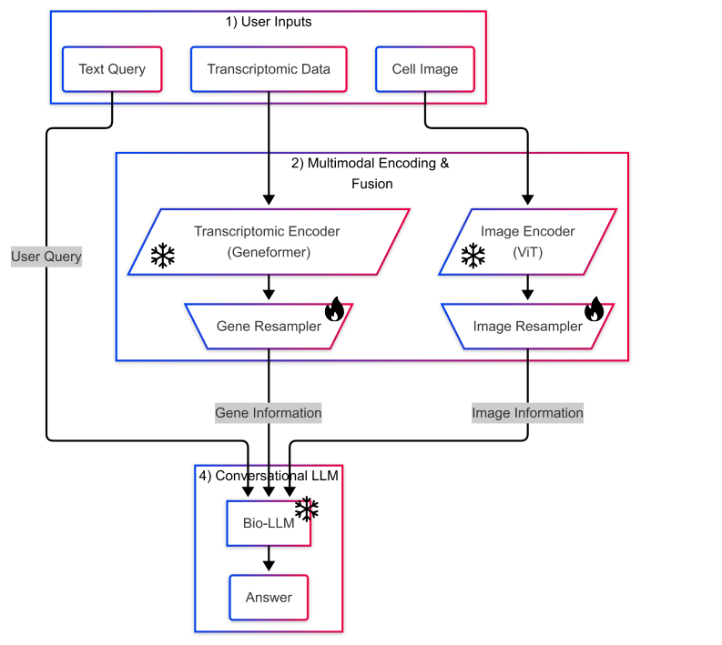
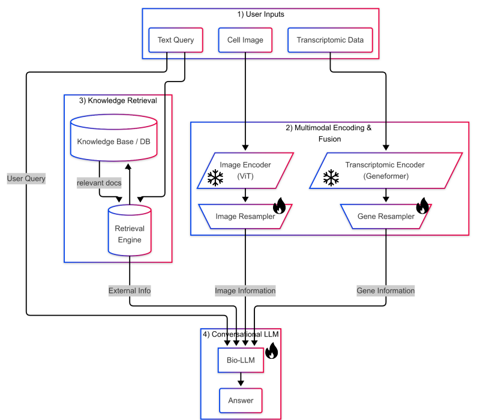

# Part 1: Multimodal AI System for Biomedical Image-Transcriptomic Integration

In this part I will provide a system design for Multimodal AI system for Biomedical Image-Transcriptomic Integration. 

**Objective:** Build a conversational tool that accepts images, transcriptomic profiles, and text queries. The system will map image features (from Optical Pooled Screen experiments) to transcriptomic states (from Perturb-seq), enabling predictions about gene knockout effects.

----

## System Architecture

To design a chatbot system we can have to approach. Explicit multimodal system or a Unified multimodal system (Similar to recent Visual-Language Models). I will go with the **Unified Multimodal System** due to their faster inferece speed and more integration with language models that the objective of the system is to design a conversational AI.


The system includes 4 main part where three (1,2,4) mandatory sections and one optional (Knowledge Retrieval) component for improved performance. The following figure shows the overall system architecture of our mulitmodal agentic system.

<p align="center">

</p>
<p style="text-align:center;">Figure 1: Overall Architecture of the System</p>

### 1. User Input

The system contain three different modalities:

- **Image**: Cells images along with their specific tags for gene KO
- **Transcriptomic Profiling**: Measurement of single cell Perturb-seq
- **Text Queries**: User input prompt for the conversational AI in the last step


### 2. Multimodal Encoding & Fusion

To incorporate image and transcriptomic data along with user prompts in conversational AI, a data ingestion module is required to integrate and standardize their dimensions. However, this mapping is not straightforward, as these modalities must be transformed into a latent space where embbeddings vectors are meaningful. Thereare two ways to incorporate different modalities into a Large Language Model: Explicit Fusion & Unified model. I choose unified represention as the model will be more robust and it helps the system to be working for a more diverse set of queries. At a high level, this module **encodes both modalities by extracting their feature and prject their embeddings into a shared space with Large Language Models token space**. This way we can leverage the information within the cell image and gene expression directly into our chatbot.

#### A. Multimodal Encoding

To effectively encode information from cell images and transcriptomic data, we leverage pre-trained models, which allow us to extract **meaningful** features without the need for training new encoders from scratch. This approach not only reduces computational overhead but also benefits from the rich representations learned from large-scale datasets. Specifically, we employ an image encoder, denoted as  $E_I$ , to extract visual features from cell images, and a transcriptomic encoder, denoted as  $E_T$ , to process transcriptomic data. These encoders transform the input modalities into corresponding feature embeddings,  $I_f$  and  $T_f$ , as follows:

$$
I_f = E_I(I_i) \\
T_f = E_T(T_i)
$$

where  $I_i$  and  $T_i$  represent the cell image and transcriptomic data for a given sample, respectively. 

The choice of the best pre-trained model can be driven by different requirements such as resource constraints, model performance and knowledge domain. Here, I utilize [CellViT](https://arxiv.org/pdf/2306.15350) as the image encoder due to its specialized training for cell segmentation and classification, and [Geneformer](https://www.nature.com/articles/s41586-023-06139-9) as the transcriptomic data encoder due to its strong performance and computational efficiency, particularly in its 95M parameter variant.


The resulting feature vectors serve as compact representations that can be utilized for downstream multimodal analysis and predictive modeling. It is worth noting that the generated embeddings have dimensions of  $(b, I_p, d_i)$  for images and  $(b, T_k, d_t)$  for transcriptomic data, where  $b$  is the minibatch size,  $I_p$  represents the number of token patches,  $d_i$  is the hidden dimension of the image encoder, and  $d_t$  is the **hidden** dimension of the transcriptomic data encoder. 


#### B. Modality Fusion

As discussed, before integrating any modality into our chatbot, we need to establish a joint latent space that unifies the representations of both modalities and the text tokens used by the LLM. We can achieve this by incorporating a fusion step and utilizing a resampler module for both image and gene embeddings. Maintaining a fixed number of tokens for each modality in our LLM input not only simplifies the implementation but also helps prevent any single modality from dominating—especially when handling a short query or a long input sequence for images and genes.


**1. Transcriptomic Resampler**

To fuse transcriptomic embeddings $T_f \in \mathbb{R}^{(b \times T_k \times d_t)}$ into a fixed-length set of tokens that can align with the LLM’s text embeddings, we employ a cross-attention resampler inspired by [Flamingo](https://arxiv.org/pdf/2204.14198). Specifically, we initialize $M_t$ trainable query vectors $\mathbf{Q^{(gene)}} \in \mathbb{R}^{M_t \times h}$ that condense and project the original transcriptomic tokens into a new space of dimension $h$. Each query effectively _“asks”_ for relevant information from all $T_k$ transcriptomic tokens.

Formally, let:

```math
\mathbf{X_{gene}} \;=\; T_f \,\mathbf{W_{tr}}^K,\quad
\mathbf{V_{gene}} \;=\; T_f \,\mathbf{W_{tr}}^V,\quad
\mathbf{Q_{gene}}^{\prime} \;=\; \mathbf{Q^{(gene)}}\,\mathbf{W_{tr}}^Q,
```

where $\mathbf{W_{tr}}^K,\mathbf{W_{tr}}^V,\mathbf{W_{tr}}^Q$ are trainable projection matrices mapping the transcriptomic embeddings (and queries) into a shared dimension $h$. The resampled output $\mathbf{R_{gene}}$ of size $\mathbb{R}^{(M_t \times h)}$ is then obtained via cross-attention:

```math
\mathbf{R_{gene}} \;=\; \mathrm{softmax}\!\Bigl(\frac{\mathbf{Q^{\prime}_{gene}} \,\mathbf{X_{gene}}^\top}{\sqrt{h}}\Bigr)\,\mathbf{V_{gene}}.
```

Because there are $M_t$ learnable queries, we end up with exactly $M_t$ resampled tokens. In other words, no matter how large $T_k$ is, the resampler outputs a fixed number of transcriptomic tokens, each now projected into a space consistent with the text embeddings used by the LLM. This design ensures that transcriptomic features do not overwhelm the LLM’s input sequence and that they occupy the same semantic embedding space as the text tokens.


**2. Image Resampler**

Similarly, we use another cross-attention resampler for the image embeddings $\mathbf{I_f} \in \mathbb{R}^{(b \times I_p \times d_i)}$, where $I_p$ is the number of patch tokens. Just like in the transcriptomic module, we initialize $M_i$ trainable query vectors that attend over all image patch embeddings and condense them to exactly $M_i$ tokens. Formally, we project the image embeddings into key-value pairs and let the queries be projected as well:

```math
\mathbf{K}_{\text{img}} = \mathbf{I_f} \, \mathbf{W_{ir}}^K,
\quad
\mathbf{V}_{\text{img}} = \mathbf{I_f} \, \mathbf{W_{ir}}^V,
\quad
\mathbf{Q}^{\prime}_{\text{img}} = \mathbf{Q}^\text{(img)} \, \mathbf{W_{ir}}^Q,
```

where $\mathbf{Q}^\text{(img)} \in \mathbb{R}^{M_i \times h}$ are the learnable queries for the image modality. Each query then computes a weighted combination of all image patches via a softmax over key–value scores:

```math
\mathbf{R}_\text{img} = \mathrm{softmax}\!\Bigl(\frac{\mathbf{Q}^{\prime}_{\text{img}}\,\mathbf{K}_{\text{img}}^\top}{\sqrt{h}} \Bigr)\, \mathbf{V}_\text{img},
```


yielding $\mathbf{R}_\text{img} \in \mathbb{R}^{(M_i \times h)}$. This effectively “resamples” the original patch tokens into a fixed number of output tokens, now aligned with the LLM’s latent space dimension $h$.


### 3. Knowledge Retrieval (Optional)

This component is **completely optional** but is included to enhance the chatbot’s accuracy by grounding responses in external knowledge, thereby reducing hallucinations in Large Language Models (LLMs). Since medical Q&A often requires domain-specific knowledge beyond what an LLM can infer from multimodal inputs, retrieval ensures responses are factually accurate and contextually relevant.

This retrieval module operates exclusively on text-based knowledge. It functions independently of multimodal data and serves as a fallback mechanism when image or transcriptomic inputs are absent, ensuring the chatbot remains reliable across different query types. The Knowledge Retrieval component consists of two main parts: *(A) Knowledge Base, (B) Retrieval Engine*.

#### A. Knowledge Base  
The Knowledge Base consists of a textual database built from biomedical literature, primarily sourced from PubMed. It contains a large collection of research papers, clinical studies, and medical guidelines relevant to cell imaging and transcriptomics.  

Mathematically, let $\mathcal{D}$ represent the knowledge base containing $N$ textual documents:

```math
\mathcal{D} = \{D_1, D_2, ..., D_N\}
```

where each document $D_i$ is an indexed biomedical text retrieved from PubMed or similar sources.

Each document is preprocessed and stored in a vectorized form to enable efficient retrieval.

#### B. Retrieval Engine  
The Retrieval Engine fetches relevant information based **solely on the user’s text prompt**, without incorporating cell images or transcriptomic sequences during retrieval. The retrieval process follows these steps:

1. **Encode User Query**:  
   Given a user query $Q$, we encode it into an embedding vector using a retrieval-specific text encoder $E_R$:

   $$Q_e = E_R(Q)$$

2. **Retrieve Relevant Documents**:  
   The system searches for the **top $k$** most relevant documents from $\mathcal{D}$ based on cosine similarity:

   $$D_{\text{retrieved}} = \underset{D \in \mathcal{D}}{\text{argmax}_k} \, \text{sim}(Q_e, E_R(D))$$

   where $\text{sim}(Q_e, E_R(D))$ measures similarity between the encoded query and each document in the knowledge base.


By decoupling retrieval from multimodal processing, this module ensures that the chatbot remains **flexible and informative**, even when cell images and transcriptomic sequences are unavailable. It also enhances the accuracy of LLM-generated responses by incorporating fact-based knowledge retrieved from biomedical literature.


### 4. Conversational LLM

We use a pretrained LLM as backbone of our conversational AI to generate response for queries. This final stage merges all relevant data from previous modules to produce the system’s response $A$. Now since all the tokens are in the shared space $h$ we can easily insert them in the LLM input sequence. Let $Q$ be the original user query, $D_{\text{retrieved}}$ be any text retrieved by the Knowledge Retrieval module, and $\mathbf{R}_{\text{img}}$, $\mathbf{R}_{\text{gene}}$ be the resampled tokens for image and gene modalities. We insert these tokens into the prompt with special brackets to contextualize their role within the text stream.

Formally, we construct the augmented query $Q_{\text{aug}}$ as follows:

```math
Q_{\text{aug}} =
\text{concat}\Bigl(
   Q,\;
   D_{\text{retrieved}},\;
   \text{"[IMAGE]"},\; \mathbf{R}_{\text{img}},\; \text{"[/IMAGE]"},\;
   \text{"[GENE]"},\; \mathbf{R}_{\text{gene}},\; \text{"[/GENE]"}
\Bigr).
```

Both $\mathbf{R}_{\text{img}}$ and $\mathbf{R}_{\text{gene}}$ can be inserted as token embeddings or otherwise encoded text so that the LLM can attend to them. The LLM then produces the final answer:

```math
A = \text{LLM}\bigl(Q_{\text{aug}}\bigr).
```

By explicitly injecting the visual and transcriptomic tokens alongside any retrieved domain knowledge, the LLM can integrate low-level multimodal signals 
$(\mathbf{R}_{\text{img}}$, $\mathbf{R}_{\text{gene}})$ with high-level textual information $D_{\text{retrieved}}$, thereby grounding its responses in both the user’s query and relevant biomedical context.

---

## Training Strategy

We can adopt a **multi-stage** training strategy that first aligns image and transcriptomic representations, then integrates them with the conversational LLM. This two-stage approach leverages available paired data and minimizes full end-to-end training of the LLM, focusing computation on smaller alignment modules:

### Stage 1: Cross-Modal Alignment Phase

In the first phase of training, we can **align image and gene data modalities with input text**. Based on the problem statement, we have a dataset containing transcriptomic data and cell images for 1,000 gene knockouts. We can leverage this dataset to generate question-answer pairs, aligning our modalities with the text token embedding space. The knocked-out gene serves as a class label, and we form questions based on sampled tuples: (Image, Gene Expression, KO Gene).

This training paradigm enables a flexible input structure and a diverse range of training data for aligning our modalities. For example, an input sequence, given some sampled data, might look like:

```python
# Example QA pair:
question = "What gene has been knocked out based on the provided image and "
           "gene expression data? [IMAGE] ... [/IMAGE] [GENE] ... [/GENE]"
answer = "The knocked out gene is {PTEN}."
```

To optimize the model we can calcualte the loss by applying cross entropy loss on the LLM predicted tokens and the groundtruth answer. However to achieve a more stable loss we can use the prefix sequence *"The knocked out gene is: "* to force the model generate a gene response for the next tokens. This way are going to have more stable training which ensure a better modality alignment. This is **similar to training a joint latent space between modalities using a classifier or contrastive learning**. However, instead of explicitly training a classifier, we aim to learn a unified shared space between three modalities in an automated manner.

<p align="center">

</p>
<p style="text-align:center;">Figure 2: Modality Alignment</p>

By freezing the LLM and the pre-trained image/gene encoders, we only train the resampler or fusion parameters in order to align these modalities with the text domain. This ensures that the representation spaces of image, gene, and text are brought into a consistent alignment, while preserving the valuable pre-learned features from the encoders.


### Stage 2: End-to-End Instruction Tuning

In the second stage of training, after ensuring modality alignment, we can instruction-tune our conversational agent to maximize usability. At this stage, we fine-tune the chatbot end-to-end using a conversational dataset containing a diverse range of questions, particularly in the domains of image and gene-related QA.

<p align="center">

</p>
<p style="text-align:center;">Figure 3: End-to-End Instruction-Tuning</p>

During my research, I was unable to find any publicly available QA dataset specifically for medical visual and gene-related question answering. Therefore, to create a small dataset for fine-tuning, we can generate a synthetic dataset. [STimage-1K4M](https://pmc.ncbi.nlm.nih.gov/articles/PMC11213178) contains image-gene expression pairs with spatial transcriptomics. By combining the dataset mentioned in the PDF with STimage-1K4M, we can heuristically generate synthetic QA pairs to instruction-tune our model for optimal compatibility.

In this step, the parameters of the image and gene encoders will be frozen, and we will train only the resampler parameters along with the LLM parameters. To reduce computational overhead and minimize modifications to the pretrained LLM parameters—thereby mitigating catastrophic forgetting—we can use parameter-efficient fine-tuning (PEFT).

During the optimization process, we can directly apply cross-entropy loss to the predicted tokens and the ground truth labels from the dataset to calculate the loss and optimize the model weights.


