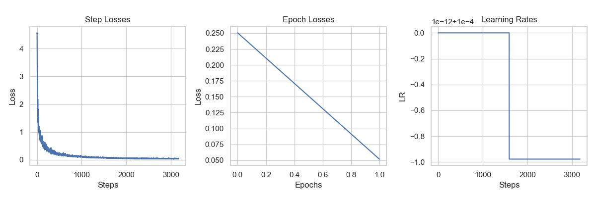

# Part 2: Coding Challenge - Multimodal Gene Expression Analysis Project

## Project Overview

This project implements a multimodal learning system that integrates textual embeddings from cell type labels with single-cell transcriptome embeddings to predict donor identifiers. The system uses data from the CellxGene Census platform, specifically focusing on human RNA measurements from the central nervous system.

The primary goal is to evaluate whether single-cell gene expression data, when combined with cell type label information, can effectively predict donor identifiers. To control for potential confounding variables, the system incorporates adversarial training to mitigate the effect of sex as a confounding factor.

## Key Components

The project is organized in a modular fashion with the following key components:

### Data Module (`utils/data.py`)
- `CellDataset`: A custom PyTorch dataset for handling cell data
- `load_ann_data`: Function to load AnnData from CellxGene Census
- `to_categorical`: Function to convert categorical data
- `generate_negative_samples`: Function for contrastive learning

### Model Architecture (`utils/model.py`)
- `TextEncoder`: Encodes cell type labels using pretrained biomedical language models
- `PerceiverResampler`: Module for resampling input sequences to a fixed number of latent vectors
- `CrossModalAttention`: Implements cross-attention between modalities
- `FusionModel`: Combines text and gene embeddings in a shared latent space
- `UnifiedMultiModalClassifier`: Main classification model with adversarial component
- `VanillaClassifier`: Baseline model for comparison

### Trainer Infrastructure (`utils/trainer.py`)
- `TrainerBase`: Base training framework with logging and device management
- `PretrainTrainer`: Handles contrastive pretraining 
- `ClassificationTrainer`: Handles adversarial classification training
- `VanillaTrainer`: Handles baseline model training

### Loss Functions (`utils/loss.py`)
- `ContrastiveLoss`: Implementation of contrastive loss for pretraining

### Project Artifacts

- `logs/`: Contains visualizations and training logs
  - `pretraining/`: Visualizations from the pretraining phase
  - `classification/`: Training metrics and model performance visualizations
  - `pretrained_umap.png`: UMAP visualization of the pretrained embeddings
- `weights/`: Contains saved model weights
  - `pretrained/`: Pretrained model for after modal alignment

## Implementation Details

### Data Preparation
- The project loads single-cell data from the CellxGene Census platform
- Filters for human RNA measurements from the central nervous system
- Extracts cell types, donor IDs, sex information, and Geneformer embeddings
- Converts categorical variables and splits data into training and testing sets

### Multimodal Integration
- Text embeddings are generated using the BioBERT model (`dmis-lab/biobert-v1.1`)
- Gene expression data is represented by Geneformer embeddings
- Cross-attention mechanism enables information flow between modalities
- Perceiver Resampler maps variable-length inputs to fixed-size latent representations

### Training Strategy
- **Pretraining phase**: Uses contrastive learning to align text and gene embeddings
- **Classification phase**: Fine-tunes the model to predict donor IDs
- **Adversarial component**: Mitigates the influence of sex as a confounding variable
- **Hyperparameter optimization**: Uses Bayesian optimization for parameter tuning

### Hyperparameter Optimization
- The project uses Optuna for Bayesian optimization of key hyperparameters
- Parameters optimized include:
  - Learning rate
  - Dropout probability
  - Number of latent vectors in the Perceiver Resampler
  - Hidden dimensions in the Perceiver Resampler
  - Weight for adversarial loss (`lambda_adv`)
- Results are captured and the best parameter set is selected for final model training

### Training Parameters
I found the best hyperparameters identified through optimization:
- `attention_heads`: 2
- `num_latent_vectors`: 16
- `hidden_size`: 384
- `dropout`: 0.3
- `learning_rate`: 1e-05
- `lambda_adv`: 0.1


## Results and Analysis

### Dataset Statistics

The dataset contains 31,780 cells with 60,664 genes. The breakdown of cell types is as follows:

| Cell Type | Count |
|-----------|-------|
| oligodendrocyte | 10,924 |
| cerebellar granule cell | 8,678 |
| microglial cell | 2,562 |
| oligodendrocyte precursor cell | 2,036 |
| GABAergic neuron | 1,744 |
| astrocyte | 1,557 |
| mural cell | 1,076 |
| capillary endothelial cell | 1,072 |
| glutamatergic neuron | 996 |
| endothelial cell of artery | 336 |
| differentiation-committed oligodendrocyte precursor | 306 |
| vascular associated smooth muscle cell | 158 |
| leukocyte | 146 |
| central nervous system macrophage | 110 |
| neuron | 52 |
| ependymal cell | 27 |

### Model Performance

The classification performance metrics for donor ID prediction are as follows:

| Model | Accuracy | Macro F1 | Weighted F1 |
|-------|----------|----------|-------------|
| Multimodal model with pretraining | 39.60% | 0.32 | 0.36 |
| Vanilla classifier (baseline) | 48.54% | 0.42 | 0.46 |

### Key Findings

1. **Donor Prediction**: Both models demonstrated the ability to predict donor IDs with accuracy significantly above random chance, indicating that single-cell gene expression data contains donor-specific signals.

2. **Pretraining Effect**: Contrary to expectations, the vanilla classifier without pretraining achieved higher accuracy. This could be due to several factors:
   - The pretraining task may not align perfectly with the downstream classification task
   - The more complex model might require more training data or epochs
   - The vanilla model has fewer parameters and might converge faster

3. **Modality Alignment**: While the multimodal approach demonstrated successful embedding alignment in shared space (as shown in the UMAP visualization), the simpler concatenation approach of the vanilla classifier performed better for classification.

4. **Cross-Attention Analysis**: The visualization of cross-attention weights reveals interesting patterns in how the model attends to different aspects of the modalities.

## Visual Results

### UMAP Visualization

*UMAP projection of cells colored by cell type, based on Geneformer embeddings*

### Embedding Space Visualization

*Visualization of the shared embedding space after pretraining*

### Training Metrics

*Pretraining metrics vs. steps*


*Classifier training metrics vs. steps*

### Cross-Attention Visualization


*Modal Cross-Attention Visualization*

## Conclusion

The project successfully demonstrates that single-cell gene expression data, combined with cell type information, can predict donor identifiers with reasonable accuracy. In addition, the results suggest that simpler models might sometimes outperform more complex architectures for specific tasks and they can converge faster.


## Installation and Usage

```bash
# Clone the repository
git clone git@github.com:pouyan9675/ubiquitous-octo-eureka.git
cd part-2

# Install dependencies
pip install -r requirements.txt

# Run jupyter notebook
jupyter notebook
```

Open the notebook `part2.ipynb` to explore the analysis and results.

## Dependencies

- PyTorch
- cellxgene_census
- scanpy
- umap
- transformers
- matplotlib
- seaborn
- optuna
- pandas
- numpy

## Acknowledgments

This project utilizes data from the [CellxGene Census](https://chanzuckerberg.github.io/cellxgene-census/) platform and the [Geneformer](https://geneformer.readthedocs.io/en/latest/) foundation model for single-cell embeddings.